<center>
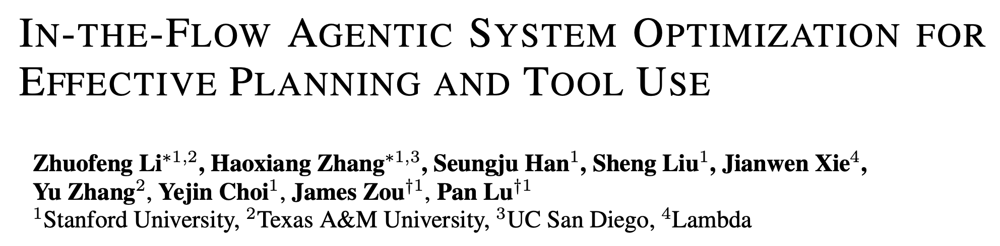

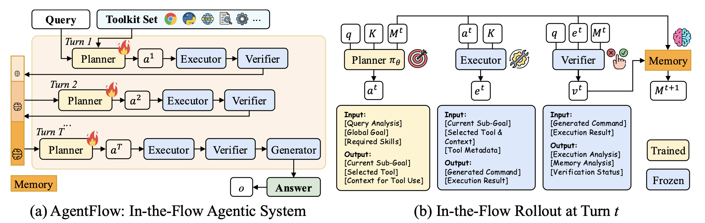

<a href="https://openreview.net/pdf?id=Mf5AleTUVK">https://openreview.net/pdf?id=Mf5AleTUVK</a>
</center>


```box
title: Core idea
tone: muted
content: |
    Train the planner of a modular agentic system directly inside the real multi-turn tool-use loop.
```


---

## Why this paper matters

Modern RL reasoning methods work well when the task has a verifiable answer.

But real tool-using agents are harder:

- Many turns
- External tools
- Evolving memory
- Sparse final rewards
- Difficult credit assignment

AgentFlow moves from **model-level training** to **system-level training**.

---

## Problem: monolithic tool-use LLMs

Many LLM agents use one model to do everything:

```text
think → call tool → read result → think again → answer
```

This can become fragile when the horizon is long or the tool feedback changes the environment.

<center>
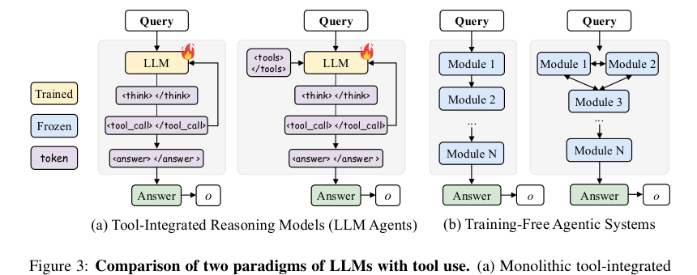
</center>

---

## AgentFlow architecture

AgentFlow decomposes the system into four modules:

| Module | Responsibility |
|---|---|
| **Planner** | decides sub-goal, tool, and context |
| **Executor** | runs the selected tool |
| **Verifier** | checks whether the result is useful / sufficient |
| **Generator** | produces the final answer |

Only the **planner** is optimized.

---

## Multi-turn execution loop

<div class="text-sm">
At each turn, the planner observes:

```text
state = query + toolset + memory
```

Then the system runs:

```text
Planner → Executor → Verifier → Memory update
```

The loop stops when the answer is ready or the turn budget is exhausted.
</div>

<center>
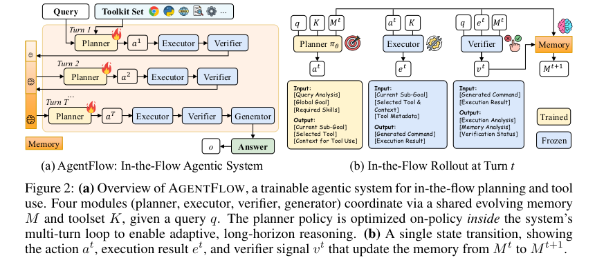
</center>

---

## What “in-the-flow” means

The planner is not trained offline from fixed trajectories.

It is trained inside the actual agent loop:

```text
plan → execute tool → verify → update memory → plan again
```

This exposes the planner to the real states it will face at inference time.

---

## Flow-GRPO: training the planner

Flow-GRPO extends GRPO to multi-turn agentic trajectories.

For each query, the system samples multiple complete rollouts, computes final reward, and compares trajectories within the group.


<center>
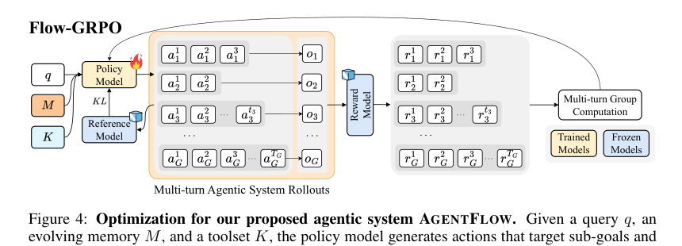
</center>

---

## Sparse reward and credit assignment

The agent receives reward only after the final answer:

```text
Action 1
Action 2
Action 3
...
Final answer → reward
```

The challenge: which action caused success or failure?

Flow-GRPO uses a simple strategy:

> Broadcast the final trajectory-level reward to every planner action.

---

## Group-normalized advantage

For each query, sample a group of trajectories.

```text
Advantage_i = (reward_i - mean(group rewards)) / std(group rewards)
```

Intuition:

- Better-than-average trajectories get positive advantage
- Worse-than-average trajectories get negative advantage
- No separate value model is needed

---

## Main results: search and agentic tasks

<div class="text-sm">
AgentFlow + Flow-GRPO improves over frozen AgentFlow and agentic baselines on search-intensive QA and GAIA.

<center>
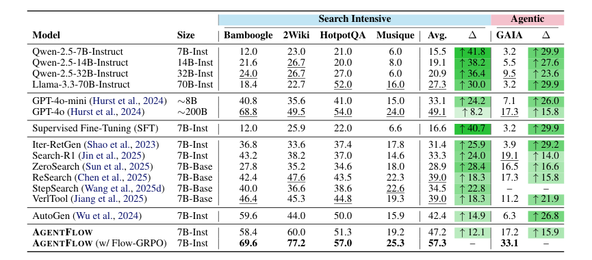
</center>

Key reported gains:

- Search-intensive QA: **+14.9%**
- Agentic reasoning: **+14.0%**
</div>

---

## Main results: math and science

<div class="text-sm">
Flow-GRPO also improves mathematical and scientific reasoning.

<center>
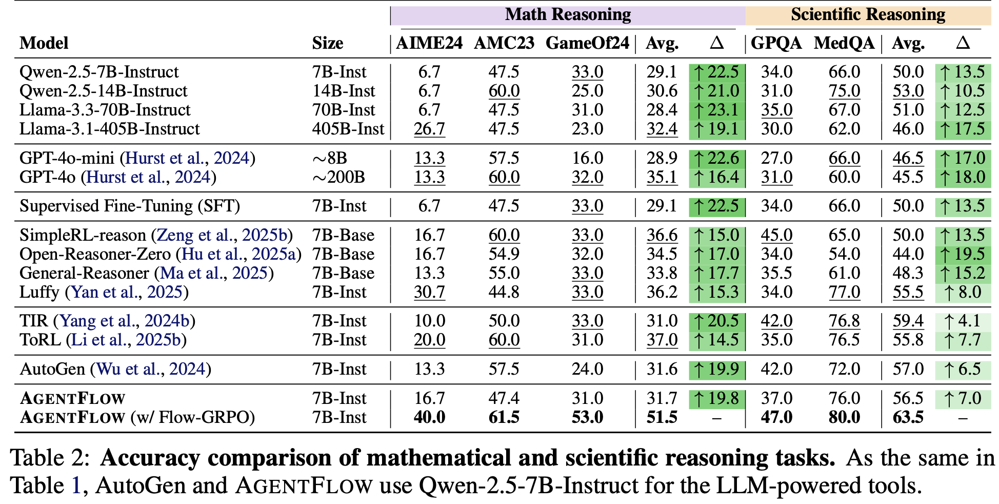
</center>

Key reported gains:

- Math reasoning: **+14.5%**
- Scientific reasoning: **+4.1%**
</div>

---

## Why stronger frozen planners are not enough

The paper compares several planner strategies:

- Frozen Qwen-2.5-7B planner
- Frozen GPT-4o planner
- Offline SFT planner
- Flow-GRPO trained planner

<center>
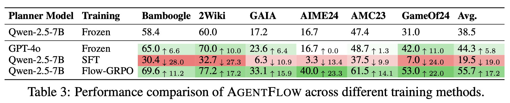
</center>

Main lesson:

> A stronger planner helps, but training in the real system dynamics matters more.

---

## Case study: self-correction

Before Flow-GRPO, the agent repeats similar failing actions.

After Flow-GRPO, it explores a new solution path and recovers.

<center>
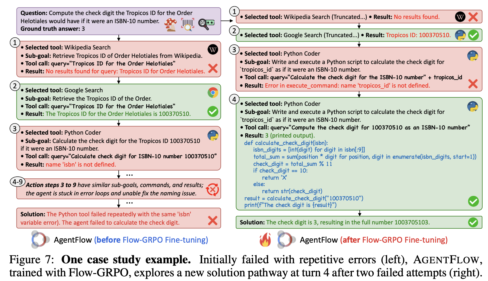
</center>

This suggests the planner learns better tool-use adaptation and error recovery.

---

## Training and scaling behavior

<!-- rows: 15/85 -->

Flow-GRPO improves reward over training and scales with model size and turn budget.

===


<!-- row-columns: 50/50 -->

<center>
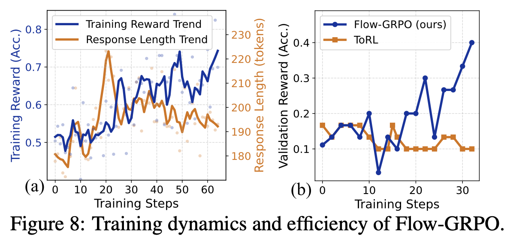
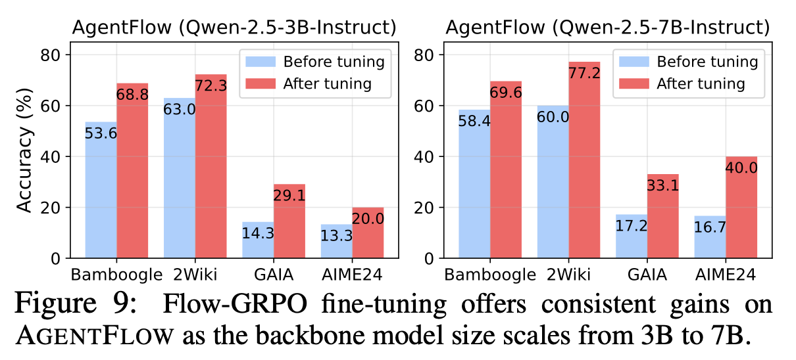
</center>

|||

<center>
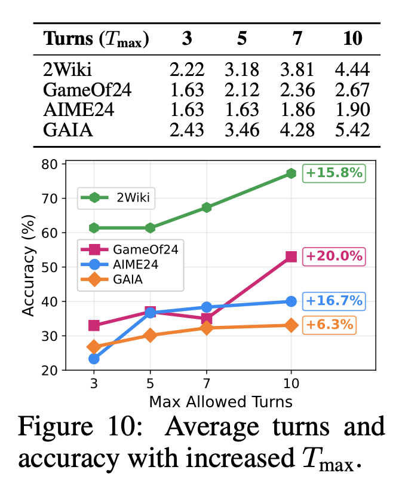
</center>

---

## Practical takeaways

For real-world agentic systems:

- Log full trajectories, not just final answers
- Separate planner from executor / verifier / generator
- Optimize for task-level outcome reward
- Train inside the real tool-use loop
- Track tool calls, turn count, retries, and self-correction behavior

---

## Final takeaway

AgentFlow reframes the problem:

```text
From: training a reasoning model
To:   training an agentic system
```

The most important insight:

> Agent training should happen at the system level, inside the workflow where the agent actually operates.
