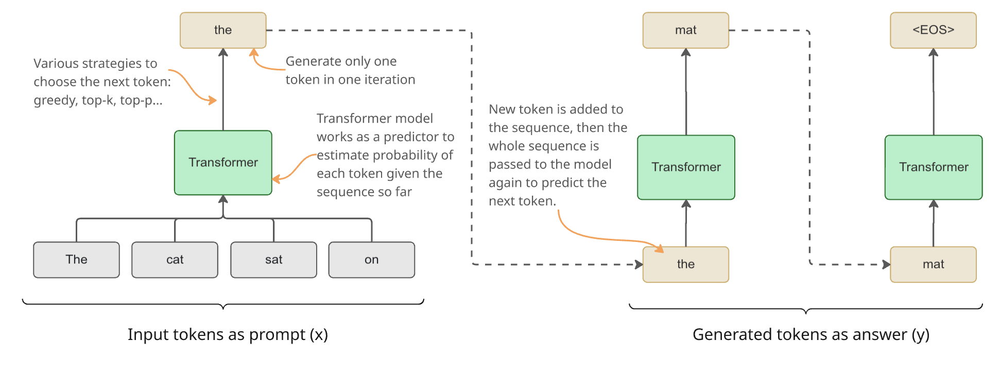
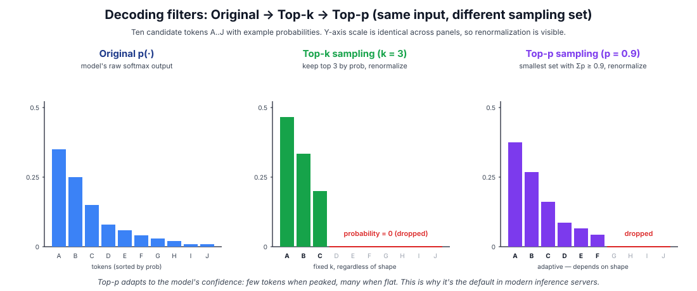
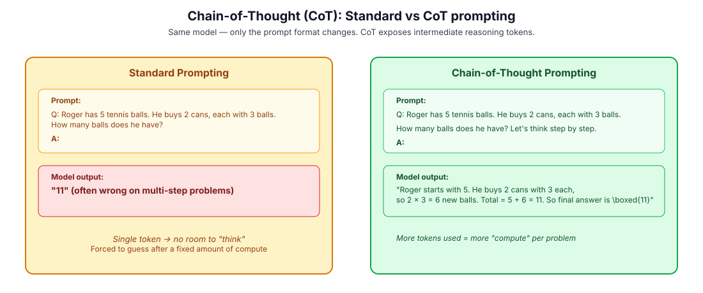
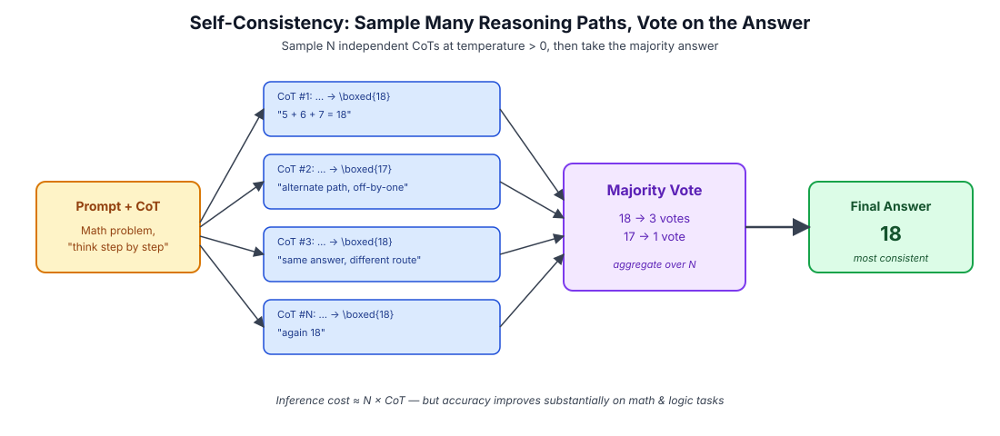
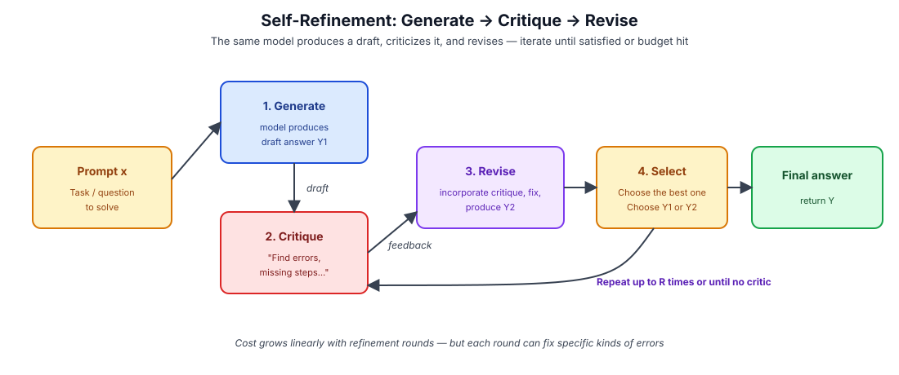
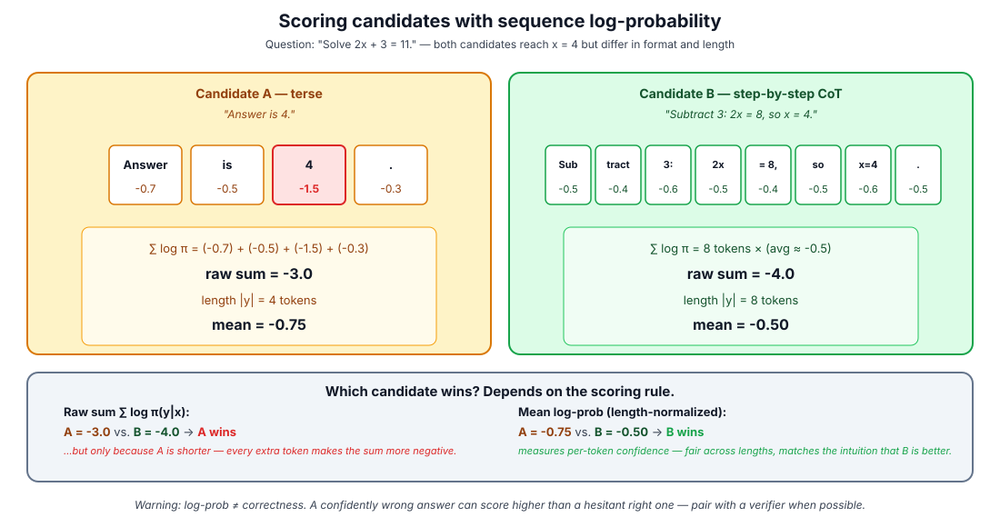
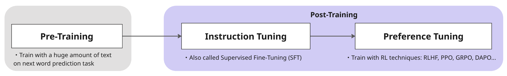
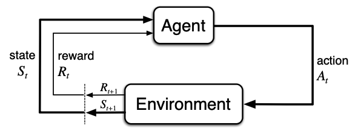
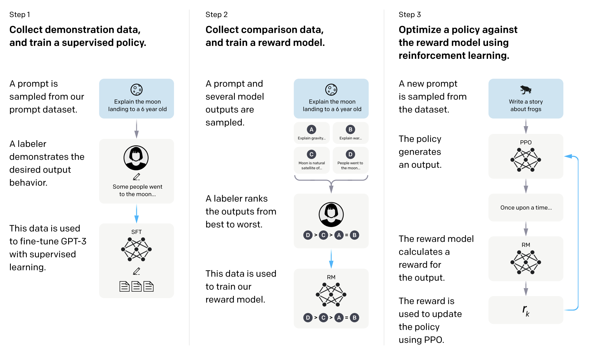
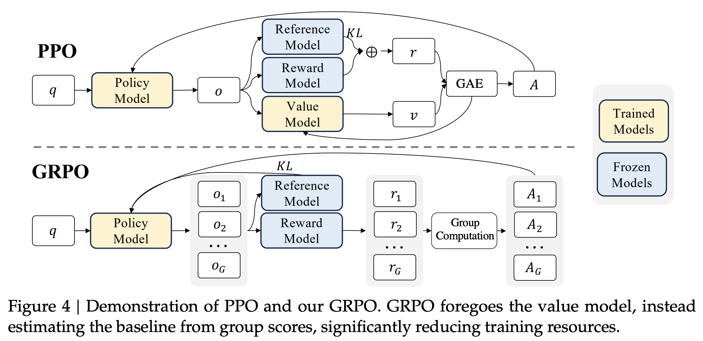

<!-- layout: title-sidebar -->
<!-- valign: middle -->

## Reasoning Models in Practice: From Inference-Time to Training-Time Scaling on Verifiable Tasks

<div class="colloquium-title-eyebrow">VJAI Seminar #2 - 2026</div>

<div class="colloquium-title-meta">
<p class="colloquium-title-name">Dat Nguyen</p>
</div>

---

```box
title: Agenda
tone: surface
content: |
  1. **Reasoning tasks & evaluation**:  what makes a task "verifiable"
  2. **Language model & text generation**:  Classifcal LM to autoregressive generation, base vs chat
  3. **Inference-time scaling**:  CoT, self-consistency, self-refinement
  4. **Training-time scaling**:  Pre-training → SFT → RLHF → PPO → GRPO → RLVR
  5. **Code walkthrough**:  the lightweight implementation in PyTorch
```

---

<!-- layout: section-break -->

## Part 1 — Reasoning tasks & evaluation

---

## What is a "reasoning task"?

A reasoning task is a question for which arriving at the correct answer requires the model to perform **several intermediate steps of inference** that are not directly retrievable from training data.

A useful working definition:

```box
title: Working definition
tone: accent
content: |
  A reasoning task is one where the **probability of a correct answer
  improves substantially when the model is allowed to produce
  intermediate "thinking" tokens** before its final answer.
```

Contrast with knowledge tasks ("What is the capital of France?"), where the answer is essentially a lookup, and intermediate tokens do not help.

---

## Examples of reasoning tasks

Different domains, same underlying property: a verifiable final answer at the end of a non-trivial chain of inference.

- **Math**:  competition problems (AIME, MATH, GSM8K). Final numeric answer can be checked against ground truth.
- **Code**:  competitive programming, function synthesis. Final answer = passing or failing test cases (HumanEval, LiveCodeBench).
- **Logic puzzles**:  Sudoku, ARC-AGI grid puzzles. Solution can be programmatically verified.
- **Theorem proving**:  Lean / Coq proofs. The proof checker is the verifier.
- **Multi-hop QA**:  questions that require chaining facts (HotpotQA-style). Verifiable when ground-truth chains exist.
- **Tool-use / agentic tasks**:  book a flight, run an experiment. The environment is the verifier.

The common thread: **a deterministic, automatic check** on the final output.

---

## What is a "reasoning model"?

A reasoning model is an LLM that has been **trained or prompted to produce extended chains of intermediate reasoning** before its final answer, in a way that materially improves accuracy on reasoning tasks.

Two useful axes for distinguishing them:

- **Where the reasoning lives**:  exposed to the user (DeepSeek-R1's `<think>` blocks) vs hidden (o1's analysis channel)
- **How the reasoning was trained**:  purely prompted (GPT-4 + CoT), SFT on reasoning traces, or RL with verifiable rewards (R1, o1)

In modern usage, "reasoning model" almost always implies the third category: **trained with RL on verifiable rewards** so that long chains of thought are not just possible but *learned*.

---

## The two scaling axes

```box
title: Inference-time vs Training-time
tone: accent
content: |
  - **Inference-time scaling**:  at test time, give the model more
    tokens / samples / refinement rounds per prompt. No weight updates.
  - **Training-time scaling**:  at train time, run more RL steps with
    verifiable rewards so the model gets *intrinsically better* at
    producing useful reasoning chains.
```

These compose: a model that's been trained with more RL also benefits more from extra inference compute. We will tour both, then connect them with a code walkthrough.

---

## Four families of LLM evaluation

We'll cover four widely-used evaluation paradigms, then return to which ones are usable as reward signals for RL.

```box
title: Four evaluation families
tone: surface
content: |
  1. **Verifiable evaluation**:  programmatic check on the final answer
     (math, code, logic). Cheap, deterministic, RL-friendly.
  2. **Multi-choice**:  pick A/B/C/D from a fixed set (MMLU, ARC).
     Cheap but limited expressivity.
  3. **Leaderboard / arena**:  pairwise human votes (Chatbot Arena).
     Captures real preferences but slow and expensive.
  4. **LLM-as-judge**:  a strong model scores responses
     (MT-Bench, AlpacaEval). Cheap but biased.
```

---

## Verifiable evaluation — Core idea

A **verifiable** evaluation is one where a short deterministic program can decide, with no human in the loop and no second model, whether a given response is correct.

This single property is what makes RLVR (Reinforcement Learning with Verifiable Rewards) possible at scale.

- **Deterministic**: same response always gets the same score
- **Automatic**: no labelers, no judges, no learned reward model
- **Cheap**: milliseconds per check; can be run for every rollout in training
- **Hard to game**: there is no "proxy" between the answer and the ground truth, so reward hacking is much harder than in RLHF

The classic example, and the workhorse of every reasoning paper since R1, is **math with a boxed final answer**.

---

## The `\boxed{...}` convention

In math reasoning datasets (MATH, AIME, GSM8K-style), the convention is for the model to put its final answer inside `\boxed{...}` (LaTeX), so the verifier can extract it with a regex and compare to the gold answer.

The full pipeline:

1. The dataset stores `(question, gold_answer)` pairs.
2. The model produces a long chain-of-thought, ending with `\boxed{42}`.
3. A regex like `r"\\boxed\{([^}]*)\}"` pulls out `"42"`.
4. A normalizer canonicalizes both strings (strip whitespace, fractions like `1/2 == \frac{1}{2}`, etc.).
5. String equality (or `sympy.simplify(a - b) == 0` for symbolic answers) decides correctness.
6. Reward = **1 if correct, 0 otherwise**.

---

## Verifiable evaluation — Full picture


---

## Verifiable math examples

Three concrete examples of math problems where the answer is locked into `\boxed{...}`:

**Example 1: GSM8K-style word problem**
> Q: Roger has 5 tennis balls. He buys 2 cans of 3 balls each. How many balls does he have now? \
> A: He starts with 5. New balls: $2 \times 3 = 6$. Total: $5 + 6 = $\boxed{11}. 

**Example 2: Algebra**
> Q: Solve for $x$: $2x + 3 = 11$. \
> A: $2x = 11 - 3 = 8$, so $x = $ \boxed{4}.

**Example 3: Competition (AIME-style)**
> Q: How many positive integers less than 100 are divisible by both 4 and 6? \
> A: lcm(4, 6) = 12. Multiples of 12 below 100: 12, 24, ..., 96 → \boxed{8} numbers. 

---

## Verifiable evaluation — Beyond math

The same recipe generalizes well:

- **Code**: gold = a unit test suite. Reward = fraction of tests that pass (or 1/0 for "all pass").
- **SQL**: gold = a target query result on a database. Reward = result-set equality.
- **Theorem proving**: gold = a Lean/Coq proof obligation. Reward = `1` iff the proof type-checks.
- **Game playing**: gold = winning the game. Reward = game outcome.

---

## Multi-choice evaluation

<div class="text-sm">

The cheapest, most widely deployed evaluation format: present a question and 4 fixed options (A/B/C/D), score the model on whether it picks the right letter.

**Examples**: MMLU (57 academic subjects), ARC (science), HellaSwag (commonsense), GPQA (graduate-level science).

**Pros**:
- Trivial to grade (string match on the letter).
- Massive coverage of topics with low marginal cost.
- Hard to "argue with": the answer is unambiguous.

**Cons**:
- Forces the model into a multiple-choice format that's unnatural at deployment.
- Vulnerable to **letter bias** (models prefer "A" or "C" all else equal).
- Memorization risk: many MCQ benchmarks have leaked into pre-training corpora.
- Coarse signal: one bit per question, less informative than a free-form answer.

</div>

---

## Leaderboard / arena evaluation

**Chatbot Arena** (lmarena.ai) is the canonical example: real users send the same prompt to two anonymous models, vote on which answer is better, and an Elo rating is computed from the pairwise comparisons.

**Pros**:
- Closest proxy we have to "real users actually liking the model."
- Captures helpfulness, style, formatting, calibration: things benchmarks miss.

**Cons**:
- **Expensive and slow**: needs millions of human votes per ranking update.
- **Confounded by stylistic preferences**: verbose, well-formatted answers tend to win even when slightly wrong.
- **Hard to use as a training signal**: you cannot vote a million times during a single RL training run.

Usable as a north-star eval, not as a per-rollout reward.

---

## LLM-as-judge evaluation

<div class="text-sm">

A cheap proxy for human preference: ask a strong frontier model (GPT, Claude, Gemini) to score or rank responses.

**Examples**: MT-Bench (single answer scored 1–10), AlpacaEval (pairwise comparison vs reference), G-Eval, RewardBench.

**Pros**:
- Much cheaper than humans (~cents per judgment).
- Reproducible: same judge + same prompt → same score.
- Can be plugged in as a reward signal in a pinch (e.g. for free-form writing tasks).

**Cons**:
- **Position bias** (judges prefer the first or second response shown).
- **Length bias** (judges prefer longer answers).
- **Self-preference bias** (a judge tends to prefer outputs from its own model family).
- A learned judge is just another **proxy reward**: and is exploitable in exactly the same way RLHF reward models are.

</div>

---

## Comparing the four — what's usable for RL?

| Evaluation | Cost | Deterministic? | Per-rollout reward? | Hackable? |
|---|:---:|:---:|:---:|:---:|
| **Verifiable** | Very low | Yes | **Yes — used in RLVR** | Hard |
| **Multi-choice** | Very low | Yes | Possible but format-distorting | Letter-bias gameable |
| **Arena (human)** | Very high | No | **No** (too slow) | Style-gameable |
| **LLM judge** | Low–med | Yes (per judge) | Yes (used in RLHF / RLAIF) | Yes — proxy hacking |

```box
title: Why this matters for the rest of the talk
tone: accent
content: |
  Only **verifiable** rewards combine all three properties needed for
  training-time scaling: cheap, deterministic, hard to hack.
  This is exactly why o1 / R1 / GRPO live in the math + code corner.
```

---

<!-- layout: section-break -->

## Part 2 — From classical language models to modern text generation

---

## What is a language model?

- A (very classic) language model assigns a **probability** to every possible sequence of text. 
- Given a prefix, it produces a probability distribution over the next token.

$$\begin{aligned}
P(x_1, x_2, ..., x_n) &= P(x_1)P(x_2|x_1)...P(x_n|x_1, ..., x_{n-1}) \\
&=\prod_{t=1}^{n} P(x_t|x_{<t})
\end{aligned}$$


```box
title: Example
tone: muted
compact: true
content: |
  The cat sat on the mat
```

$$
P(\text{The, cat, sat, on, the, mat}) = P(\text{The}) \times P(\text{cat}|\text{The}) \times P(\text{sat}|\text{The, cat}) \times ... \times P(\text{mat}|\text{The, cat, sat, on, the})
$$

---

## Text generation problem

- Given a prompt $x$, a model $\pi_\theta$ generates a completion by finding $y$ that maximize $P(y|x)$.

$$
P(y | x) \approx \prod_{t=1}^{n} \pi_\theta(y_t|x, y_{<t})
$$

- Note: we use $\pi_\theta(\cdot)$ to denote the probability estimated by the model with parameters $\theta$.

---

## How a transformer LM generates text

<center>
    
</center>


- Generation is a **loop**: at step $t$, feed $(x, y_{<t})$ through the model
- The model estimates probability of all tokens ${w_i \in \text{vocab } V }$ given $(x, y_{<t})$
- From the distribution over V, sample a token from $\pi_\theta(\cdot \mid x, y_{<t})$, append it, repeat until EOS or max len.
- Various **decoding strategies** decide *how* to sample: greedy (argmax), top-$k$, top-$p$ (nucleus), temperature scaling. Inference-time scaling techniques sit on top of this loop.

---

## Decoding strategy 1: Greedy
- Choose the token with the highest probability as the next token:

$$
y_t = \text{argmax}_{w_i \in V} \pi_\theta(w_i \mid x, y_{<t})
$$

- Choosing the token with the highest probability at each step does not ensure the highest probability sequence.

---

## Decoding strategy 2: Temperature scaling

<div class="text-sm">

- <strong>Temperature</strong> T rescales the logits $z_i$ before the softmax:

$$
\pi_{\theta, T}(w_i \mid x, y_{<t}) = \frac{\exp(z_i / T)}{\sum_{j \in V} \exp(z_j / T)}
$$

- $T = 1$: the original model distribution $\frac{\exp(z_i)}{\sum_{j \in V} \exp(z_j)}$
- $T \to 0$: distribution collapses onto the argmax → recovers **greedy decoding**.
- $T < 1$: distribution becomes **sharper** → more deterministic, less diverse.
- $T > 1$: distribution becomes **flatter** → more random, more creative.

- **In practice for reasoning models:**
    - Use $T \approx 0$ when you want a **single stable answer** (final evaluation, production inference).
    - Use $T \in [0.7, 1.0]$ when **sampling many diverse chains-of-thought** for self-consistency, diversity is the whole point.
- **Note**: temperature alone does **not** remove low-probability tokens, it only reshapes the distribution. 
- Sampling over the whole dictionary is costly, so usually combine it with top-k or top-p.
</div>

---

## Decoding strategy 3: Top-k filtering

- **Top-k sampling**: at each step, keep only the $k$ tokens with the highest probability, zero out the rest, and **renormalize** the remaining probabilities so they sum to 1.

$$
V_k = \text{Top-}k\big(\{\pi_\theta(w_i \mid x, y_{<t})\}_{w_i \in V}\big), \qquad
\tilde{P}(w_i) = \frac{\pi_\theta(w_i \mid x, y_{<t}) \cdot \mathbb{1}[w_i \in V_k]}{\sum_{w \in V_k} \pi_\theta(w \mid x, y_{<t})}
$$

- Sample from $\tilde{P}$, usually **combined with temperature**. Typical values: $k = 40$ to $50$.
- The **problem** with fixed $k$: the shape of the distribution varies step by step.
    - When the model is **very confident** (e.g. completing *"The capital of France is"*), almost all mass sits on 1–2 tokens. Top-40 includes 38 tokens of pure noise.
    - When the model is **uncertain** (e.g. creative writing, open-ended reasoning), 40 may be too narrow and cut off plausible continuations.
- Top-k was popular in the GPT-2 era; it has been largely superseded by top-p for this reason.

---

## Decoding strategy 4: Top-p (nucleus) filtering

- **Top-p sampling** (a.k.a. **nucleus sampling**): keep the **smallest** set $V_p$ of tokens whose cumulative probability is at least $p$, then renormalize.
- Sort tokens by probability descending; let $V_p$ be the smallest prefix such that

$$
\sum_{w \in V_p} \pi_\theta(w \mid x, y_{<t}) \ge p
$$

- Zero out everything outside $V_p$, renormalize, sample. Typical values: $p = 0.9$ or $0.95$.
- **Advantage over top-k**: $|V_p|$ is **adaptive**
    - The set shrinks when the model is confident
    - Grows when it is uncertain. 
- Default in modern inference servers (vLLM, TGI, SGLang) and in almost all modern  reasoning models.
- For reasoning rollouts (e.g. GRPO training), typical setup: **$T = 1.0$ with top-p = 0.95**

---

## Comparing the filters visually

<center>
    
</center>

<div class="text-sm">

- **Top-k** keeps a fixed number of tokens regardless of the distribution's shape (always 3 here).
- **Top-p** keeps whatever number of tokens is needed to cover 90% of the mass (here it picked 6).
- Both **renormalize** the surviving tokens to sum to 1, so the kept bars get *taller* than in the original.
- The usual production recipe: **temperature + top-p**, with top-k disabled or set very high (e.g. $k=1000$) as a safety net only.

</div>

---

## What "thinking" actually is


```box
title: This is the single most important conceptual
tone: accent
content: |
  When a reasoning model "thinks," it is **emitting tokens** into the
  visible context, then attending back over those tokens on the next
  forward pass. "Thinking" is just **more tokens spent before the
  final answer**.
```

This means:
- More thinking = **more compute** (more forward passes, more attended context).
- We hope that the generated tokens create **meaningful and useful** text.
- The model's "thoughts" are an artifact you can read, log, score, and even use as supervision.
- Test-time scaling = literally letting the model emit more tokens.


---

<!-- layout: section-break -->

## Part 3 — Inference-time scaling

---

## What is inference-time scaling?

**Inference-time scaling** is any technique that improves a model's performance on a task by **spending more compute at generation time**, without changing the model's weights.

Three knobs you can turn:

- **More tokens per attempt**: let the model think longer (CoT, longer reasoning).
- **More attempts per problem**: sample many candidates and aggregate (self-consistency, best-of-N).
- **More iterations per attempt**: let the model critique and revise its own work (self-refinement).

All three trade FLOPs for accuracy. The art is knowing which to spend on which task.

---

## Three popular techniques

- In this part of the talk we'll cover three foundational inference-time techniques. 
- They are simple, composable, and form the building blocks for everything fancier (Tree-of-Thoughts, Reflexion, MCTS-style search, etc.).

```box
title: The three techniques
tone: surface
content: |
  1. **Chain-of-Thought (CoT)**: let the model think out loud before answering
  2. **Self-consistency**: sample many CoTs, take a majority vote
  3. **Self-refinement**: generate, critique, revise in a loop
```

---

## 1. Chain-of-Thought (CoT) — the core idea

<!-- cite-right: wei2023chainofthought -->

**Chain-of-Thought prompting** is the simplest inference-time technique: instead of asking the model to jump straight to an answer, prompt it to write out the intermediate reasoning steps.

Two variants:

- **Few-shot CoT**: show the model a few examples of "question → reasoning steps → answer," then ask the new question.
- **Zero-shot CoT**: just append "Let's think step by step." to the prompt and let the model produce reasoning unprompted.

Both work surprisingly well on math, logic, and multi-step QA. CoT was the first widely-used technique that converted *more tokens* into *more accuracy*.

---

## Chain-of-Thought prompting

<center>

</center>

- Standard prompting answers immediately and is often wrong
- CoT prompting elicits intermediate reasoning steps and dramatically improves multi-step problems.

---

## Why CoT works (intuition)

A few mutually reinforcing explanations for why CoT helps:

- **More compute per problem**: each emitted reasoning token is one extra transformer forward pass. Longer outputs literally apply the model more times.
- **Decomposition**: multi-step problems are hard to solve in one token because the answer distribution is sharp on the wrong tokens; CoT factors the joint into easier conditional sub-problems.
- **Self-conditioning**: once the model writes "5 + 6 = 11" into its own context, the final "11" becomes a very high-probability completion. The model leverages its own intermediate work as input.
- **Distribution match**: pre-training data contains a lot of step-by-step explanations (textbooks, tutorials), so the *distribution of correct CoTs* is well-supported by the model's prior.

---

## CoT — when it helps and when it doesn't

CoT is not free. A short list of where to use it and where to skip it.

**Helps a lot on**:
- Multi-step arithmetic / word problems
- Logical reasoning, planning, multi-hop QA
- Code where the model has to reason about edge cases

**Helps little or hurts on**:
- Pure recall tasks ("capital of France")
- Tasks where the model is already at ceiling
- Latency-sensitive deployments (CoT is several times slower per query)

A recurring practical lesson: CoT on a model that hasn't been **post-trained for reasoning** can introduce as many errors as it fixes. Reasoning models trained with RLVR are far more robust to long CoT.

---

## 2. Self-consistency — the core idea

- **Self-consistency** generalizes CoT: instead of one greedy reasoning chain, sample $N$ independent CoTs at temperature $> 0$, then take the **majority vote** over the final answers.
<!-- cite-right: wang2023selfconsistency -->

- The intuition is borrowed from ensembling and from how humans solve hard problems: 
    - There are many valid reasoning paths to the right answer, and **the right answer is the one that many independent paths agree on**, while wrong answers tend to be idiosyncratic.
git
- Cost is roughly $N \times$ a single CoT, so this is a clean **compute → accuracy** dial.

---

## Self-consistency — How it works



In practice, $N = 8$ to $40$ is typical; gains keep coming up to $N \approx 100$ on hard math sets, then saturate.

---

## Self-consistency — Properties

A few properties worth internalizing:

- **Requires a verifiable extractor**: to vote, you need to extract a comparable final answer from each CoT (e.g. the `\boxed{...}` content).
- **Trades parallelism for serial latency**: you can sample the $N$ chains in parallel, so wall-clock cost is closer to $1\times$ if you have multi GPUs.
- **Composes with CoT and self-refinement**: you can refine each of the $N$ chains, or refine the final majority answer.
- **Bias-variance angle**: self-consistency reduces *variance* across reasoning paths. It does not fix systematic biases of the underlying model.

A close cousin is **best-of-N**, where instead of voting you score each candidate with a verifier or a learned reward model and pick the highest-scoring one.

---

## 3. Self-refinement — the core idea

<!-- cite-right: madaan2023selfrefine -->

**Self-refinement** uses the same model in two roles: as a **generator** that produces a draft answer, and as a **critic** that points out flaws in that draft. The generator then **revises** based on the critique.

Three roles, all played by the same model:

1. **Generate** $y_1 = \pi(\cdot \mid x)$
2. **Critique** $c_1 = \pi(\cdot \mid x, y_1, \text{"find the errors"})$
3. **Revise** $y_2 = \pi(\cdot \mid x, y_1, c_1, \text{"fix the errors"})$
4. **Compare** $y_1$ & $y_2$. Then select the better one.

Repeat until the critic finds no more issues, or a budget is hit.

---

## Self-refinement — visualized



- Self-refinement helps most when the **critic step actually finds errors**. 
- On tasks where the model is fundamentally confused, asking the same model to critique its own work tends to cement mistakes rather than fix them.

---

## Scoring candidate solutions — sequence log-probability

<div class="text-sm">

- Self-refinement needs a way to **compare two candidate sequences** and pick the better one. We need a scoring function.
- The simplest and **cheapest** score, one we get **for free** from generation, is the model's own log-probability of the sequence:

$$
\log \pi_\theta(y \mid x) = \sum_{t=1}^{|y|} \log \pi_\theta\!\left(y_t \mid x,\, y_{<t}\right)
$$

```box
title: Intuition
tone: muted
content: |
  "how confident was the model, on average, at each step of producing this sequence." A higher (less negative) log-prob means the sequence is more **natural** under the model.
```

- Every per-token $\log \pi_\theta(y_t \mid x, y_{<t})$ was already computed by the forward pass during generation, scoring is essentially **free**.

- In code (Pytorch):

```python
logits    = model(input_ids).logits[:, :-1, :]            # logits of each position from the model
log_probs = F.log_softmax(logits, dim=-1)                 # compute log-prob of all tokens on each position
targets   = input_ids[:, 1:].unsqueeze(-1)                # get the target tokens. Shifted by 1
token_lp  = torch.gather(log_probs, dim=-1, index=targets).squeeze(-1)  # look up the log-prob of the target token on each pos
seq_logp  = (token_lp * completion_mask).sum(dim=-1)      # sum of log-probs of all generated tokens in the sequence
```

</div>

---

## Length normalization — and what log-prob cannot measure

<div class="text-sm">

- **Problem**: every per-token log-prob is negative, so the raw sum is **systematically biased toward shorter sequences**. A terse answer always has a higher raw log-prob than a detailed chain-of-thought that reaches the same conclusion.
- **Fix**: divide by sequence length to get the **mean log-prob**:  equivalently, the log of the geometric mean token probability:

$$
\text{score}(y \mid x) = \frac{1}{|y|} \sum_{t=1}^{|y|} \log \pi_\theta\!\left(y_t \mid x, y_{<t}\right)
$$

</div>


<center>
    
</center>

---

## Note on log-prob

<div class="text-sm">

- **Caveat 1: log-prob is confidence, not correctness**. A fluent, confident-but-wrong answer often scores higher than a hesitant, correct one. The model scores how much *itself* "believes" the sequence, not whether the sequence is right.
- **Caveat 2: better options exist when available**
    - (1) **Verifier** for tasks with ground truth (math, code)
    - (2) **Reward model** for open-ended tasks
    - (3) **LLM-as-a-judge**: the model scoring its own candidates with an explicit rubric. 

```box
title: NOTE
tone: muted
content: |
  Log-prob is the cheap fallback, not the best signal.
```

</div>

---

## Combining inference-time techniques

These three techniques **compose**, and most reasoning systems in the wild use combinations.

- **CoT + Self-consistency**: sample N CoTs, vote. The standard "math benchmark" recipe.
- **CoT + Self-refinement**: generate one CoT, critique, revise. Good for code and writing.
- **All three**: sample N CoT + refine each + vote. Highest accuracy, highest cost.
- **Process reward model (PRM)**: train a separate model that scores each *step* of the CoT, not just the final answer. Used as a step-by-step search heuristic.

---

## When to use which

A practical decision table for picking an inference-time strategy:

| Task | Recommended technique |
|---|---|
| **Math / logic puzzles, accuracy critical** | CoT + self-consistency, large $N$ |
| **Code generation with tests** | CoT + best-of-$N$ scored by tests |
| **Open-ended writing / summarization** | CoT + self-refinement |
| **Latency-critical chat** | Single short CoT, no sampling (greedy) |
| **Agentic / tool-use** | CoT + refinement, tool feedback as critic |

These knobs are **bounded** by the underlying model, eventually you stop getting returns. Which is exactly why we now turn to **training-time scaling**.

---

<!-- layout: section-break -->

## Part 4 — Training-time scaling

---

## Why we need training-time scaling

Inference-time scaling has hard limits:

- **Diminishing returns**: accuracy gains flatten well before you've spent unbounded compute.
- **Costs scale per query**: every user, every prompt pays the inference-time tax.
- **No new capability**: you cannot make the model do anything it could not already do; you are only sampling its existing distribution more thoroughly.

Training-time scaling **changes the model itself**. Capabilities that required 100 self-consistency samples can be baked in so they appear in a single greedy decode. The economics flip: **pay once at training, save every query**.

---

## The two scaling curves, unified

<!-- cite-right: openai2024o1, guo2025deepseekr1 -->

- **Train-time RL compute → reasoning accuracy** (you pay once, every user benefits)
- **Test-time thinking compute → reasoning accuracy** (you pay per query)

Both curves are unlocked by the **same thing**: a verifiable reward signal that you can grind on for billions of tokens during training, and that the model has learned to chase at inference time.

```box
title: The unifying observation
tone: accent
content: |
  RLVR converts inference-time compute (which the user pays) into
  training-time compute (which the lab pays). A model trained with
  more RL needs less thinking per query to hit a given accuracy.
```

---

## Overview of LLM training stages



This is the canonical picture. In what follows we walk left-to-right and add detail to each box, ending with the rightmost box (preference / RL tuning) blown up into PPO and GRPO.

---

## Modern recipe: SFT then RL

Almost every modern reasoning model follows the same multi-stage recipe:

1. **Pre-training**: next-token prediction on trillions of web tokens. Builds the base capabilities.
2. **Mid-training / cool-down**: high-quality data mix for the last 5–10% of pre-training tokens.
3. **Instruction tuning (SFT)**: teach the model the chat format and basic helpfulness.
4. **Reasoning SFT**: fine-tune on long chains-of-thought (often distilled from a stronger reasoning model).
5. **Reinforcement learning**: RLHF, RLVR, or both, depending on whether the goal is style or correctness.

We will spend the rest of the talk unpacking stages 1–5, with most attention on stage 5.

---

## Pre-training

<!-- cite-right: kaplan2020scaling -->

**Pre-training** is the phase where a randomly-initialized transformer is trained to predict the next token on a massive corpus of text.

- Corpus size: **5–50+ trillion tokens** (web, books, code, papers).
- Compute: typically **months on thousands of GPUs**.
- Objective: cross-entropy on next-token prediction.
- Output: a "base model" with broad world knowledge but no chat behavior.

Pre-training accounts for the majority of training compute spent on a frontier model, and per the **Elicitation Theory** of post-training, it sets the *ceiling* of what the model can ever do. Post-training only **reaches** that ceiling.

---

## Pre-training objective

The full sequence likelihood factorizes by the chain rule, so the loss is simply the average per-token cross-entropy:

$$
\mathcal{L}_{\text{pre}}(\theta)
= - \mathbb{E}_{x \sim \mathcal{D}} \sum_{t=1}^{|x|} \log \pi_\theta(x_t \mid x_{<t})
$$

---

## What the base model learns

Pre-training implicitly teaches the model many things it was never explicitly supervised on:

- **Syntax and grammar**: of dozens of natural and programming languages
- **World facts**: capitals, dates, formulas, code library APIs
- **Latent skills**: translation, summarization, arithmetic, code completion (the "in-context learning" of GPT-3)
- **A bias toward the most common continuation**: which is exactly what we'll need to fix in post-training

```box
title: The pre-training / post-training divide
tone: accent
content: |
  Pre-training optimizes for "**most likely** next token."
  Post-training optimizes for "**most useful** next token."
  These are not the same objective.
```

---

## From base model to chat model

A **base model** trained only on next-token prediction is a glorified autocomplete:

Given "What is 2+2?", it might continue with another math question rather than answering.

Useful for completion, useless as a chatbot. Post-training fixes this by reshaping the response distribution:

- **Instruction tuning (SFT)**: teaches the model the question-answer format.
- **Preference tuning (RLHF / DPO)**: teaches the model *which* answers humans like.
- **RLVR**: teaches the model to produce *correct* answers on verifiable tasks.

---

## Instruction tuning — the gap to close

Instruction tuning (a.k.a. SFT, supervised fine-tuning) closes the gap by:

- Showing the model many `(prompt, ideal response)` pairs in a structured chat format.
- Training with standard cross-entropy on the **response tokens only** (prompt tokens are masked from the loss).
- Using a much smaller dataset (100K – 1M examples).

The model emerges able to answer questions in the expected role-based format.

---

## Instruction tuning — the SFT loss

<!-- cite-right: ouyang2022training -->

The supervised fine-tuning loss is just pre-training's cross-entropy, but applied **only to the assistant's response tokens** $y$ given the prompt $x$:

$$
\mathcal{L}_{\text{SFT}}(\theta)
= - \sum_{(x, y) \in \mathcal{D}} \sum_{t=1}^{|y|}
\log \pi_\theta\!\left(y_t \mid x, y_{<t}\right)
$$

In a chat template:
```
<|im_start|>user
What is 2+2?<|im_end|>
<|im_start|>assistant       <-- everything before this is masked out
4<|im_end|>                 <-- gradients only on these tokens
```

The model learns to **answer like a chatbot**, but does not yet learn **which** answer humans prefer when several plausible ones exist.

---

## Why we still need preference tuning

SFT teaches the model a good answer for each prompt, typically the one a human labeler wrote. But for any prompt there are many plausible answers, varying in tone, length, helpfulness, safety, calibration.

Two responses can both be technically correct but vastly different in usefulness:

- **Verbose, hedging, technically correct** vs **concise, direct, confident**
- **Safe but unhelpful refusal** vs **helpful with appropriate caveats**
- **Plausible-sounding but wrong** vs **shorter, less confident, but right**

SFT cannot easily express "I prefer A over B." We need a way to push the model toward *preferred* completions. That's the job of **preference tuning**.

---

## Preference tuning — two flavors

There are two main flavors of preference tuning, both still in widespread use:

- **RLHF (Reinforcement Learning from Human Feedback)**: train a reward model on human preference pairs, then use RL (PPO, GRPO, ...) to optimize the policy against that reward model. The classic recipe behind ChatGPT.
- **DPO (Direct Preference Optimization)**: a closed-form alternative that optimizes preferences directly without an explicit reward model. Simpler to implement, ~80% of the gain in many cases.

For reasoning models trained on verifiable tasks, a third path opened up:

- **RLVR (Reinforcement Learning with Verifiable Rewards)**: same RL machinery as RLHF, but the reward comes from a deterministic verifier instead of a learned reward model.

---

<!-- layout: section-break -->

## Part 4a — The path to modern RLHF

---

## Classical reinforcement learning - The agent–environment interface

The classical RL loop: agent picks an action based on its policy; environment returns the next state and a reward; repeat. The reward function is given, not learned.

<center>
    
</center>

<!-- cite-right: sutton2018reinforcement -->

In classical RL, the **environment is the source of truth** for both state transitions and rewards. The agent's job is to discover a policy that maximizes long-term reward through trial and error.

---

## Classical reinforcement learning - Formal definitions

<!-- cite-right: sutton2018reinforcement -->

A reinforcement learning problem is formalized as a **Markov Decision Process (MDP)**:

$$
\text{MDP} = (\mathcal{S},\, \mathcal{A},\, P,\, r,\, \gamma)
$$

- $\mathcal{S}$: state space, $\mathcal{A}$: action space
- $P(s_{t+1} \mid s_t, a_t)$: transition dynamics
- $r(s_t, a_t)$: reward function (known, defined by the environment)
- $\gamma \in [0, 1]$: discount factor
- $\tau = (s_0, a_0, r_0, s_1, a_1, r_1, \ldots)$: trajectory, a record of the agent's experience

The agent picks actions according to a **policy** $\pi(a \mid s)$, observes the next state and reward, and seeks to maximize the expected return:

$$
J(\pi) = \mathbb{E}_{\tau \sim \pi}\!\left[\sum_{t=0}^{T} \gamma^t \, r(s_t, a_t)\right]
$$

---

## Why classical RL doesn't directly transfer to LMs

Three properties of language modeling break the standard RL setup:

- **The "environment" is a dataset.** Prompts are sampled, not produced by a Markovian dynamics. There is no real $P(s_{t+1} \mid s_t, a_t)$, at the token level, the transition is deterministic (append the token).
- **The reward function is hard to write.** "Helpful," "harmless," "well-written" cannot be expressed in code. We need **learned rewards** (RLHF) or **verifiable proxies** (RLVR).
- **The reward is sparse and terminal.** The model speaks for hundreds or thousands of tokens before any reward arrives, credit assignment is the central technical challenge.

These three differences shape every algorithmic choice that follows.

---

<!-- layout: section-break -->

## Part 4b — Reinforcement Learning from Human Feedback

---

## Why we made RLHF

<!-- cite-right: christiano2017, ouyang2022training -->

For many tasks the reward function is **hard to write down**:

- It is easy to **judge** which poem is better, but hard to write a rule that scores poems.
- It is easy to **spot** a helpful answer, but hard to specify "helpful" as a formula.
- Pre-training optimizes for the **most likely** next token, the most likely continuation is rarely the most useful one.

RLHF lets us optimize for behavior we can **evaluate** even when we cannot easily **specify** the reward function, by learning the reward from human comparisons.

---

## RLHF — the InstructGPT 3-step recipe

The InstructGPT three-step RLHF recipe (figure 2 from Ouyang et al., 2022): demonstration data → reward model → RL against the reward model with PPO.

<center>
    
</center>

<!-- cite-right: ouyang2022training -->

<div class="text-sm">

This figure became the canonical mental model for "how ChatGPT was trained" and remains the backbone of every modern recipe.

</div>

---

## RLHF Step 1 — Supervised fine-tuning (SFT)

The foundation, identical to instruction tuning above:

- Start from a pre-trained base model.
- Collect demonstrations of *desired* assistant behavior.
- Train with cross-entropy on prompt → response pairs.

$$
\mathcal{L}_{\text{SFT}}(\theta)
= - \sum_{(x, y) \in \mathcal{D}} \sum_{t=1}^{|y|}
\log \pi_\theta\!\left(y_t \mid x, y_{<t}\right)
$$


After SFT, the model can follow instructions in a chat format. Now we need a way to compare candidate responses.

---

## RLHF Step 2 — Reward model training

<!-- cite-right: christiano2017, ouyang2022training -->

Collect **comparison data**: for the same prompt, two model outputs $y_w$ (winning) and $y_l$ (losing), labeled by a human (or AI) annotator.

Train a reward model $r_\phi(x, y)$ to score the preferred completion higher:

$$
P(y_w \succ y_l \mid x) = \sigma\!\left(r_\phi(x, y_w) - r_\phi(x, y_l)\right)
$$

The reward model is trained by minimizing the negative log-likelihood:

$$
\mathcal{L}_{\text{RM}}(\phi) = -\,\mathbb{E}_{(x, y_w, y_l) \sim \mathcal{D}}\,
\log \sigma\!\left(r_\phi(x, y_w) - r_\phi(x, y_l)\right)
$$

In other words: **the reward is the model's predicted log-odds that a given response would beat a random alternative**.

---

## RLHF Step 3 — RL against the reward model

The third step is where RL shows up. The maximizing objective:

$$
J(\theta)
= \mathbb{E}_{x \sim \mathcal{D},\; y \sim \pi_\theta(\cdot \mid x)}\!\left[ r_\phi(x, y) \right]
\;-\; \beta \, D_{\text{KL}}\!\left(\pi_\theta(\cdot \mid x)\,\|\,\pi_{\text{ref}}(\cdot \mid x)\right)
$$

Read this as **"maximize reward, but don't drift too far from the reference model (SFT model)."** 

The two terms:

- $\mathbb{E}[r_\phi(x, y)]$: the reward model says "make this completion higher-quality."
- $\beta \, D_{\text{KL}}(\pi_\theta \| \pi_{\text{ref}})$: the KL penalty says "but stay close to what you already knew."
    - Punish for drifting from the reference.
    - Defense against **reward hacking**: score high on the reward model but are degenerate under the original distribution.
    - $\beta$ is the knob that controls the trade-off, typically 0.01–0.1 for RLHF, often 0 for RLVR.

---

<!-- layout: section-break -->

## Part 4c — Proximal Policy Optimization (PPO)

---

## From reward to a policy gradient


Set the KL term aside for a moment and focus on the reward part of $J(\theta)$:

$$J(\theta) \;=\; \mathbb{E}_{x \sim \mathcal{D},\, y \sim \pi_\theta(\cdot \mid x)}\!\left[ r_\phi(x, y) \right]$$

How do we maximize this? Apply the **log-derivative trick** $\nabla_\theta \pi_\theta = \pi_\theta \nabla_\theta \log \pi_\theta$ to push the gradient inside the expectation:

$$\nabla_\theta J(\theta) \;=\; \mathbb{E}_{y \sim \pi_\theta}\!\left[\,\nabla_\theta \log \pi_\theta(y \mid x)\, \cdot\, r_\phi(x, y)\,\right]$$

This is the **vanilla policy gradient** (REINFORCE): *up-weight responses that got high reward, down-weight ones that didn't*.

- **Problem**:
The expectation is over $y \sim \pi_\theta$, the **current** policy. The instant we update $\theta$, our rollouts are stale. We'd have to generate fresh rollouts after every gradient step. For LLMs, where generation dominates compute, this is unaffordable.

---

## Reusing rollouts via importance sampling

<div class="text-xs">

We want **many** gradient steps per batch of rollouts. Trick: collect responses with a frozen snapshot $\pi_{\theta_{\text{old}}}$, then optimize $\pi_\theta$ off-policy.

The **importance sampling identity**:

$$\mathbb{E}_{y \sim p}[f(y)] \;=\; \mathbb{E}_{y \sim q}\!\left[\frac{p(y)}{q(y)}\, f(y)\right]$$

Setting $p = \pi_\theta$ and $q = \pi_{\theta_{\text{old}}}$, and decomposing the response $y$ into its tokens $y_t$ given the prefix $(x, y_{<t})$, the per-token importance ratio is:

$$\rho_t(\theta) \;=\; \frac{\pi_\theta(y_t \mid x, y_{<t})}{\pi_{\theta_{\text{old}}}(y_t \mid x, y_{<t})}$$

The objective $J(\theta) = \mathbb{E}_{x \sim \mathcal{D},\, y \sim \pi_\theta}\!\left[ r_\phi(x, y) \right]$ (the objective, not the gradient) becomes: 

$$\begin{aligned}
J(\theta) = \mathbb{E}_{x \sim \mathcal{D},\, y \sim \pi_\theta}\!\left[ r_\phi(x, y) \right]
= \mathbb{E}_{x \sim \mathcal{D},\, y \sim \pi_{\theta_{old}}}\!\left[ \frac{\pi_\theta(y|x)}{\pi_{\theta_{old}}(y|x)} r_\phi(x, y) \right]
\end{aligned}$$

We've also replaced the raw reward with the **advantage** $\hat{A}_t$, same idea, lower variance.

$$
J_{\text{IS}}(\theta) = \mathbb{E}_{x \sim \mathcal{D},\; y \sim \pi_{\theta_{\text{old}}}}\!\left[\, \frac{1}{|y|} \sum_{t=1}^{|y|} \frac{\pi_\theta(y_t \mid x, y_{<t})}{\pi_{\theta_{\text{old}}}(y_t \mid x, y_{<t})}\, \hat{A}_t \,\right]
= \mathbb{E}_{x \sim \mathcal{D},\; y \sim \pi_{\theta_{\text{old}}}} \left[\, \frac{1}{|y|} \sum_{t=1}^{|y|} \rho_t(\theta)\, \hat{A}_t \,\right]
$$

Now we can take many gradient steps on the same batch: $\rho_t$ corrects for the drift between $\pi_\theta$ and $\pi_{\theta_{\text{old}}}$.

- **New problem**: If $\pi_\theta$ drifts too far, $\rho_t$ can blow up, one outlier token dominates the gradient and training becomes unstable.

</div>

---

## Clipping the ratio → the PPO objective

<div class="text-sm">

PPO's fix is brutally simple: **clip $\rho_t$ to a small trust region** $[1-\epsilon,\, 1+\epsilon]$, and take the pessimistic side of the bound.

$$
\boxed{\;\;
J_{\text{PPO}}(\theta)
\;= \mathbb{E}_{x \sim \mathcal{D},\; y \sim \pi_{\theta_{\text{old}}}} \left[\,\frac{1}{|y|}\sum_{t=1}^{|y|}\min\!\Big(\,\rho_t(\theta)\, \hat{A}_t, \mathrm{clip}\big(\rho_t(\theta),\, 1-\epsilon,\, 1+\epsilon\big)\, \hat{A}_t\,\Big)\,\right]
\;\;}
$$

How the `min` and `clip` work together at each token $t$:

- **$\hat{A}_t > 0$** (good token): clip caps gain at $1+\epsilon$: stop rewarding ourselves once we've already pushed this token's probability up enough.
- **$\hat{A}_t < 0$** (bad token): clip floors loss at $1-\epsilon$: stop over-correcting based on stale data.
- **`min`** picks the more conservative of the two: gradient turns off as soon as $\pi_\theta$ tries to drift outside the trust region.

```box
title: Importance sampling lets PPO reuse each batch of rollouts for many gradient steps; **clipping** keeps those reused gradients from exploding.
tone: accent
```

</div>

---

## The full LLM-PPO objective in practice

<div class="text-xs">

Slide 3 dropped the KL for clarity. In real RLHF pipelines, it comes back, but **not** in the loss. Instead, the per-token KL is folded directly into the reward:

$$
\tilde{r}_t \;=\; \underbrace{r_\phi(x, y)\,\mathbb{1}[t = |y|]}_{\text{reward model, terminal token only}} \;-\; \beta\, \underbrace{\log\frac{\pi_\theta(y_t \mid x, y_{<t})}{\pi_{\text{ref}}(y_t \mid x, y_{<t})}}_{\text{per-token KL to the SFT model}}
$$

The advantage $\hat{A}_t$ is then computed from these *KL-shaped* per-token rewards $\tilde{r}_t$ (typically via GAE), and plugged into the same clipped objective from slide 3:

$$
J_{\text{PPO}}(\theta) \;=\; \mathbb{E}_{x,\,y}\!\left[\,\frac{1}{|y|}\sum_{t=1}^{|y|}\min\!\Big(\frac{\pi_\theta(y_t \mid x, y_{<t})}{\pi_{\theta_{\text{old}}}(y_t \mid x, y_{<t})}\, \hat{A}_t,\;\; \mathrm{clip} \big(\frac{\pi_\theta(y_t \mid x, y_{<t})}{\pi_{\theta_{\text{old}}}(y_t \mid x, y_{<t})},\, 1-\epsilon,\, 1+\epsilon\big)\, \hat{A}_t\Big)\,\right]
$$

Why inject KL into the reward instead of the loss?

- **Per-token credit assignment**: drift is penalized *where it happens*, not just averaged over the response.
- **Same machinery**: the optimizer sees one unified advantage signal; no extra loss term to balance.
- **Clean dial**: $\beta$ controls reward hacking without touching the PPO clip.

With a **verifiable** reward (math correct? tests pass?), the proxy is exact and reward hacking largely disappears, so practitioners often set $\beta = 0$ and drop the reference model entirely. That's one of the simplifications **GRPO** will exploit.

</div>

---

## Where does $\hat{A}_t$ come from? PPO's value network

<div class="text-xs">

We've been treating $\hat{A}_t$ as if it falls from the sky. In PPO it doesn't, it's computed from a **second neural network**, the **value function** $V_\phi(x, y_{<t})$, trained alongside the policy.

$V_\phi$ predicts the *expected future reward* from token position $t$ onward. The advantage is then "actual reward minus expected reward":

$$\hat{A}_t \;=\; \underbrace{\tilde{r}_t + \gamma\, V_\phi(x, y_{\le t})}_{\text{what actually happened}} \;-\; \underbrace{V_\phi(x, y_{<t})}_{\text{what we expected}}$$

(In practice this is smoothed across multiple steps via **Generalized Advantage Estimation (GAE)**, but the intuition is the same.)

$V_\phi$ is trained by regression to the empirical returns:

$$\mathcal{L}^{\text{VF}}(\phi) \;=\; \mathbb{E}_t\!\left[\big(V_\phi(x, y_{<t}) - \hat{R}_t\big)^2\right]$$

```box
title: Why this is painful for LLMs
tone: accent
```

- **Memory**: $V_\phi$ is typically the *same size* as the policy (a copy of the LLM with a scalar head). Training PPO means holding **policy + reference + reward model + value model** in memory. ~4× the parameters.
- **Compute**: every gradient step now optimizes two networks, with their own forward/backward passes.
- **Hard to learn**: $V_\phi$ must predict expected return at *every token position* of *every prompt*, from a sparse, end-of-sequence reward signal. It's noisy and slow to converge.
- **Bias from a bad critic**: early in training $V_\phi$ is wrong, so $\hat{A}_t$ is wrong, so the policy gradient is biased. PPO inherits whatever errors $V_\phi$ makes.

This is the cost GRPO is going to eliminate, by replacing $V_\phi$ with a much simpler baseline computed from a *group* of rollouts.

</div>

---

<!-- layout: section-break -->

## Part 4d — Group Relative Policy Optimization (GRPO)

---

## GRPO — Motivation

<!-- cite-right: shao2024deepseekmath, guo2025deepseekr1 -->

GRPO was introduced in **DeepSeekMath** (Feb 2024) for math reasoning and was popularized by **DeepSeek-R1** (Jan 2025). Its design is explicitly a response to PPO's pain points in the RLVR setting:

- The value function $V_\phi$ is **the most fragile component of PPO**: bad initialization wrecks early training.
- The value function adds **substantial memory overhead** (one extra model copy)
- For RLVR, rewards are **sparse 0/1 verifier outputs**: high variance, exactly the regime where critic estimates are least reliable.

GRPO's idea: **drop the value function entirely** and use group statistics over multiple rollouts as the baseline.

---

## GRPO — Core idea

For each prompt $x$, generate **$G$ completions** $y_1, \ldots, y_G$ (typical $G = 4, 8, 16, 32$).

Compute their rewards $R_1, \ldots, R_G$ (e.g. all 0/1 from a math verifier).

Use the **group's reward statistics** as the baseline:

$$
\hat{A}_i = \frac{R_i - \mu_G}{\sigma_G}, \qquad
\mu_G = \frac{1}{G}\sum_{j=1}^G R_j, \qquad
\sigma_G = \sqrt{\frac{1}{G}\sum_{j=1}^G (R_j - \mu_G)^2}
$$

Positive if it beat the group average and negative otherwise. **No critic needed.**

---

## GRPO — Objective

The full GRPO loss combines PPO-style clipped ratios with the group-normalized advantage and an optional KL penalty in the loss (not in the reward):

$$
J_{\text{GRPO}}(\theta) =
\mathbb{E}_{x \sim \mathcal{D},\; \{y_i\}_{i=1}^{G}} \sim \pi_{\theta_{\text{old}}}

\!\left[
\frac{1}{G} \sum_{i=1}^{G} \frac{1}{|y_i|} \sum_{t=1}^{|y_i|}
\left(\min\!\left(
\frac{\pi_\theta(y_{i,t} \mid x, y_{i,<t})}{\pi_{\theta_{\text{old}}}(y_{i,t} \mid x, y_{i,<t})}\, \hat{A}_i,\;
\mathrm{clip}\!\left(
\frac{\pi_\theta(y_{i,t} \mid x, y_{i,<t})}{\pi_{\theta_{\text{old}}}(y_{i,t} \mid x, y_{i,<t})},\;
1-\epsilon,\;1+\epsilon\right) \hat{A}_i\right) - \beta \mathbb{D}_{KL} (\pi_\theta || \pi_{ref}) \right)
\right]
$$
<!-- cite-right: guo2025deepseekr1 -->

where the importance sampling ratio is per-token but the advantage $\hat{A}_i$ is **shared across all tokens in completion $i$** (sequence-level advantage).

---

## GRPO vs PPO

<center>
    
</center>
<!-- cite-right: shao2024deepseekmath -->

- From the DeepSeekMath paper: 
    - PPO needs a learned value model to compute advantages via GAE. 
    - GRPO replaces the value model with simple group statistics over multiple sampled completions.
- The yellow boxes are the trained models: PPO has two, GRPO has one.

---

## GRPO vs PPO — head-to-head

| | **PPO** | **GRPO** |
|---|---|---|
| **Value function** | Learned $V_\phi$ (a whole model copy) | None |
| **Advantage** | Per-token via GAE | Sequence-level |
| **KL penalty** | Folded into reward (per-token) | Separate term in the loss (per-token) |
| **Models in memory** | 4 (policy, value, ref, RM) | 2–3 (policy, ref, RM or verifier) |
| **Best fit** | General RLHF with learned RM | RLVR with sparse 0/1 rewards |
| **Implementation complexity** | Higher | Lower |

The pattern: **GRPO is PPO minus the value function, plus a statistical group baseline.** The PPO-style clipping is preserved; only the advantage estimator changes.

---

## RLVR — Reinforcement Learning with Verifiable Rewards

<!-- cite-right: lambert2024t, guo2025deepseekr1 -->

Now we can name the recipe that powers DeepSeek-R1 and friends:

```box
title: RLVR in one paragraph
tone: accent
content: |
  Apply the same RL algorithms (PPO, GRPO, REINFORCE, ...) to LLMs,
  but replace the learned reward model with a **deterministic
  verifier**:  for math, the verifier extracts \boxed{·} and checks it
  against the gold answer; for code, it runs unit tests; for proofs,
  it runs the proof checker.
```

- **No learned reward model → no proxy objective → much less reward hacking.**
- KL penalty is often reduced or removed entirely (since the reward is ground truth).
- Term coined in **Tülu 3** (Lambert et al. 2024), popularized by **DeepSeek-R1**.

---

## RLVR — what disappears vs RLHF

A side-by-side that makes the simplification visible:

| Component | RLHF | RLVR |
|---|:---:|:---:|
| Reward model training stage | Required | **Removed** |
| Reward model in memory | Required | **Removed** (replaced by a function) |
| KL penalty | Critical (defends against RM hacking) | Often **reduced or removed** |
| Reward signal | Continuous, learned, biased | Discrete (0/1), exact |
| Reward variance | Lower per sample, higher hacking risk | Higher per sample, lower hacking risk |
| Reward speed | One forward pass per completion | Microseconds (regex + compare) |

The fewer moving parts, the more compute can be poured into the actual policy gradient.

---

## Classical RL vs RLHF vs RLVR — summary table

| | **Classical RL** | **RLHF** | **RLVR** |
|---|---|---|---|
| **Environment** | Real or simulated | Dataset of prompts | Dataset of prompts |
| **State transitions** | Stochastic, given by env | Deterministic (append token) | Deterministic (append token) |
| **Reward source** | Environment (known) | Learned reward model | Verifier (regex + compare, tests, ...) |
| **Reward granularity** | Per-step | Per-response (terminal) | Per-response (terminal) |
| **Reward type** | Dense, continuous | Continuous, learned proxy | Sparse, discrete 0/1 |
| **Main risk** | Exploration | Reward hacking | Task generalization, mode collapse |
| **Signature algorithm** | DQN, A3C, SAC | PPO with reward model | GRPO with verifier |
| **Canonical example** | CartPole | InstructGPT / ChatGPT | DeepSeek-R1, o1 (math, code) |

---

## The trend — simpler algorithms, more compute

A high-level pattern across the last three years of RL-on-LLMs:

- **2022 (InstructGPT)**:  Full PPO with learned RM, GAE, value function, KL in reward.
- **2024 (DeepSeekMath)**:  GRPO drops the value function. Group baseline replaces GAE.
- **2025 (DeepSeek-R1, Olmo 3)**:  GRPO + verifier for math/code. Often no KL, no SFT before RL.
- **2025+ (DAPO, Dr.GRPO, GSPO, CISPO)**:  Further simplifications and length-normalization tricks; more compute, simpler losses.

```box
title: The bitter lesson, again
tone: accent
content: |
  As reward signals get more reliable, the algorithm gets **simpler**
  and the **compute budget gets bigger**. The cleverness moves from
  the optimizer to the data and infrastructure.
```

---

<!-- layout: section-break -->

## Part 5 — Code walkthrough: the minimal GRPO pipeline

---

## My implementation

<a href="https://github.com/vjai-community/tiny-reasoning-model" class="colloquium-builtwith">https://github.com/vjai-community/tiny-reasoning-model</a>

---

## Inference-time scaling results

<div class="text-xs">

- Model: `Qwen/Qwen2.5-0.5B`
- Eval Dataset: `HuggingFaceH4/MATH-500`
- Notations:
    - `base`: base-prompting
    - `cot`: cot-prompting

</div>

```chart
type: bar
data:
  labels: [base500, base800, cot_500, cot_800, self-consistency_3rollouts_base500, consistency_3rollouts_cot800, self-consistency_5rollouts_base500, consistency_5rollouts_cot800]
  datasets:
    - label: Training
      data: [0.206, 0.2369, 0.214, 0.268, 0.2068, 0.212, 0.2068, 0.212, 0.238, 0.2365]
      color: "#4AA691"
options:
  scales:
    x:
      grid: {display: false}
    y:
      grid: {display: false}
```

---

## Training-time scaling results

<div class="text-xs">

- Base Model: `Qwen/Qwen2.5-0.5B`, training data: [MATH (minus MATH-500)](https://github.com/rasbt/math_full_minus_math500)
- Eval Dataset: `HuggingFaceH4/MATH-500`
- Notations: 
    - `base`: base-prompting, `cot`: cot-prompting
    - `grpo_with_kl`: GRPO with KL penalty, `grpo_no_kl`: GRPO without KL penalty
    - `x-axis`: 0 for no fine-tune (=base model), k>0 for fine-tuned with GRPO @ k samples
    

</div>

```chart
type: line
data:
  labels: [Base-model, GRPO@50, GRPO@100, GRPO@150, GRPO@200, GRPO@400, GRPO@600]
  datasets:
    - label: grpo_with_kl_base
      data: [0.206, 0.212, 0.148, 0.152, 0.1844, 0.1844, 0.164]
      color: "#4AA691"
    - label: grpo_with_kl_cot
      data: [0.268, 0.256, 0.2, 0.178, -, 0.2044, 0.1924]
      color: "#0B1A14"
    - label: grpo_no_kl_base
      data: [0.206, 0.236, 0.25, 0.24, 0.256, 0.2445, -]
      color: "#f51616ff"
    - label: grpo_no_kl_cot
      data: [0.268, 0.3, 0.296, 0.296, 0.2846, 0.3052, -]
      color: "#462af9ff"
options:
  scales:
    x:
      grid: {display: false}
    y:
      grid: {display: false}
```

---

<!-- layout: section-break -->

## Part 6 — Wrap-up

---

## Key takeaways

```box
title: Key takeaways
tone: accent
content: |
  1. **Verifiable rewards**: are the engine, without a cheap deterministic
     check, you cannot do RLVR at scale.
  2. **Inference-time scaling** (CoT, self-consistency, self-refinement)
     is real but bounded, it samples capability, doesn't create it.
  3. **Training-time scaling** with RL **moves the capability ceiling**: 
     this is what o1, R1, o3 are doing.
  4. **GRPO is PPO minus the value function**: drop the critic, use
     group statistics for the baseline, keep the clipped surrogate.
  5. **The hard parts are not the math**: they are masking, padding,
     stale log-probs, zero-std groups, and reward hacking.
```

---

## Resources

```box
title: Books & lectures
tone: surface
content: |
  - **rlhfbook.com** (Nathan Lambert) — the source for most of this talk
  - **"Build a Reasoning Model From Scratch"** (Sebastian Raschka, MEAP)
  - **DeepSeek-R1 paper** (Guo et al. 2025) — read the appendices
  - **DeepSeekMath paper** (Shao et al. 2024) — the original GRPO
```

---

<!-- rows: 85/15 -->
## Thank you

Questions / discussion

Contact: nptdat@gmail.com

===

```builtwith
repo: natolambert/colloquium
```
